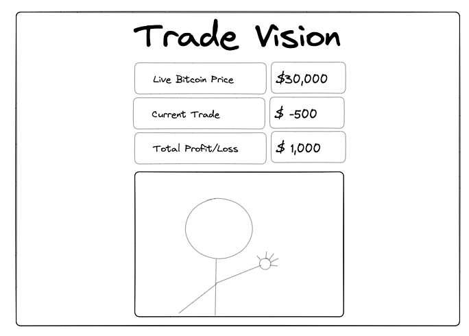

# Trade Vision

An app built using Agile methodologies that allows users to buy and sell bitcoin using hand gestures that are detected live through their webcam.

(Note: This has not been built for mobile due to the restrictions of the object detection model)

# Contents

- [Technologies](#technologies)
- [Demo](#demo)
- [Planning](#planning)
- [MVP User Stories](#mvp-user-stories)
- [Sprint Planning](#sprint-planning)
- [Implementation](#implementation)
- [Frontend Testing](#frontend-testing)
- [Backend Testing](#backend-testing)
- [Running The Application](#running-the-application)
- [Next Steps](#next-steps)

# Technologies

<div align="center">
	<code></code>
	<code></code>
	<code></code>
	<code></code>
	<code></code>
</div>

# Demo


# Planning

With the use of object detection becoming more commonplace I thought it would be an interesting idea to try to utilise the technology to guide the User Experience by controlling the User Interface with hand gestures.

To begin the process I started out by creating User Stories to help decide what features would need to be built for an MVP.

# MVP User Stories

```
As a user
I want to be able to
Open a trade with a hand gesture

As a user
I want to be able to
Close a trade with a hand gesture

As a user
I want to be able to
See the live price of Bitcoin

As a user
I want to be able to
See myself on screen

As a user
I want to be able to
See profit/loss for the trade

As a user
I want to be able to
See total profit/loss
```

After creating the User Stories these were translated into a wireframe to give a structure to the app. This helped to visualise different components that would be needed and how the information would be conveyed in an intuitive way to the user.



# Sprint Planning

After creating user stories to understand the required features, e.g. the live price of Bitcoin, these were broken down into individual smaller tickets.

The first sprint focused on Test Driving the backend with Jest. With the second sprint focusing on creating the frontend components, using Cypress to Test Drive.

## Implementation

For this project a pre-trained hand detection model was used, [handtrack.js](https://github.com/victordibia/handtrack.js/) . The decision was taken to use a pre-trained model, rather than training a custom model, due to the time it takes to label the data. It would require manually labelling approximately 1,000+ images to create a reasonably accurate model.

For the backend, Node is used to make fetch requests to the [Binance API](https://www.binance.com/en/binance-api) which has no limitations regarding volume of requests, it also does not require an API key.

To help the user process the information on screen the API requests are made every 3 seconds. This provides a consistent regular update but does not overwhelm the user with rapidly changing data.

The frontend is built using Javascript, React, HTML and CSS. The app is kept modular with each component being reusable in the future when we want to display other asset classes.

# Frontend Testing

Every component was tested with Cypress. By conducting unit testing in isolation when each branch was merged into our main they integrated smoothly. By using Cypress the testing ensured all components mounted properly as well as page functionality, such as buttons working correctly.

# Backend Testing

The backend was Test Driven using Jest. As it made an external API call this was mocked during the test as it was non-deterministic. This was done by creating a mock JSON object that would be returned within the test, avoiding making the external API call within the test.

# Running The Application

1. Clone the repo locally.
2. Run `npm install `
3. Open a second command line terminal.
4. In one terminal navigate to the api directory. In the other navigate to frontend.
5. In api run the command `node app.js` and you should see a message that says 'server is running'.
6. In frontend run `npm start` and this will open the app in your browser.

# Next Steps

1. Trade confirmation animations.
2. Integrate backend database to store users records.
3. Create user registration/log in functionality.
4. Trade other asset classes.

# Credits

The pre-trained model used in this project was created by Victor Dibia and his work can be found here https://github.com/victordibia/handtracking
